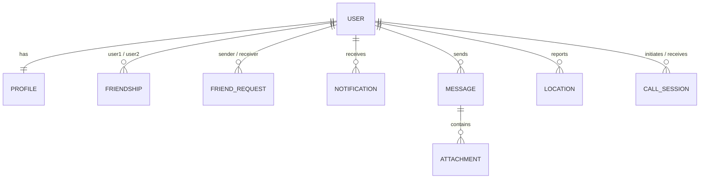

<div align="center">

# 💬 ChatBuzz
### *(TalkTime Modern Rebuild)*

**A state-of-the-art, high-fidelity, real-time communication platform** designed using **Google Stitch AI** aesthetics — featuring persistent multi-channel workspaces, WebRTC voice/video calls, geospatial mapping, dynamic story reels, and an interactive notifications center.

</div>

---

## 📑 Table of Contents

- [🚀 Key Product Features](#-key-product-features)
- [🛠️ Technology Stack](#️-technology-stack)
- [📂 Architecture & Directory Structure](#-architecture--directory-structure)
- [🛢️ Database Model Relationships](#️-database-model-relationships)
- [🔌 API Endpoints Reference](#-api-endpoints-reference)
- [📡 WebSocket Namespace Reference](#-websocket-namespace-reference)
- [⚙️ Installation & Setup](#️-installation--setup)
- [🚢 Deployment Architecture](#-deployment-architecture)

---

## 🚀 Key Product Features

### 1. Workspaces & Channel-based Messaging
- **Workspace Dashboards** — High-fidelity glassmorphic selection grid (Emerald Nebula theme) presenting all user workspaces dynamically.
- **Channels** — Separated communication channels (Text/Voice) inside each workspace.
- **Rich Client Editor** — Fully supports attachments, file uploads, nested replies, and message editing.
- **Realtime Streaming** — Instant message delivery powered by Socket.IO namespaces.

### 2. Live WebRTC Video & Voice Calls
- **Direct Calls** — Initiate voice or video call streams with any online friend instantly.
- **P2P Connection** — Direct peer-to-peer audio/video piping with canvas rendering.
- **Global Overlay** — An application-wide overlay listener that rings for incoming calls, allowing users to Accept or Decline from any page.
- **Call Logger** — Logs call durations, types (voice/video), and final statuses (`answered`, `missed`, `declined`, `completed`).

### 3. BuzzMap (Geospatial Geolocation)
- **Interactive Mapping** — Integrated Leaflet Maps API plotting active friends around the globe.
- **Real-time Position Syncing** — Updates location coordinates seamlessly via the backend API.
- **Light/Dark Adaptive Map Styles** — Adapts the map tiles dynamically based on the application's active light or dark theme.

### 4. Echoes (Stories & Status Reels)
- **Visual Statuses** — Share photos or videos containing custom captions that disappear after 24 hours.
- **Upload Support** — Robust file processing using Multer backend buffers piped to Cloudinary.
- **Active View Counters** — Tracks and renders view history metrics per story.

### 5. Interactive Notifications Bell
- **Dynamic Badge Count** — Realtime counters showing unread message notifications and pending friend requests.
- **Hover Popover** — Sliding popover containing detailed previews of received friend requests or direct messages.
- **Read All Actions** — Instantly clear unread badges by marking notifications as read in a single click.

### 6. Emerald Nebula Design Aesthetics
- Curated light/dark-mode theme toggle.
- Polished obsidian glassmorphism wrappers, pulsing status indicators, and smooth Framer Motion micro-animations.

---

## 🛠️ Technology Stack

### Frontend (Next.js Application)
| Layer | Tech |
|---|---|
| Framework | Next.js 16.2 (App Router with Server Actions & React Server Components) |
| Styling | TailwindCSS v4 & CSS Variables |
| Icons | Lucide React |
| Animations | Framer Motion |
| Components | Radix UI (Avatar, Dialog, Popover, Dropdown, Toast, Tooltip) |
| Map API | Leaflet & React-Leaflet |
| API Client | Fetch API with custom JWT-refresh interceptor wrappers |
| Socket Client | Socket.IO-Client v4 |

### Backend (Express/Node.js Server)
| Layer | Tech |
|---|---|
| Server Frame | Express with TypeScript (`ts-node-dev`) |
| Database | MongoDB (via Mongoose ODM) |
| Cache & Session | Redis (v4) |
| WebSockets | Socket.IO Server |
| Cloud Media Hosting | Cloudinary & Multer |
| Security | Helmet, CORS policies, and Express Rate Limiting |
| Logging | Pino & Pino-Pretty |

---

## 📂 Architecture & Directory Structure

```
talk-time-app/
├── .github/workflows/          # GitHub Actions CI/CD workflows
├── playwright/                 # Playwright test setups and user storage states
├── server/                     # Self-contained Express/MongoDB backend
│   ├── src/
│   │   ├── config/             # Database and application environment setups
│   │   ├── controllers/        # REST route handlers (Auth, Messages, Calls, etc.)
│   │   ├── middleware/         # CORS, Rate Limiting, Authentication, Uploads
│   │   ├── models/             # Mongoose schemas (User, Message, Notification)
│   │   ├── repositories/       # Mongoose abstraction layer
│   │   ├── routes/             # REST route mapping
│   │   ├── services/           # Business logic (Sockets, WebRTC, Friendship)
│   │   ├── sockets/            # Socket.io namespaces and event managers
│   │   └── server.ts           # Server entry point
│   ├── tsconfig.json           # Backend compiler rules
│   └── package.json            # Node backend scripts and dependencies
├── src/                        # Next.js Frontend Application
│   ├── actions/                # Next.js Server Actions (Auth, Workspaces, Echoes)
│   ├── app/                    # Next.js App Router (Layouts & Pages)
│   ├── components/             # Reusable UI component modules (Call, Friends, Chat)
│   ├── hooks/                  # Client React hooks (Toasts, Theme, Sockets)
│   ├── lib/                    # Client API fetch wrappers and Socket Managers
│   └── proxy.ts                # Next.js Route Interception Proxy (Middleware)
├── tsconfig.json               # Next.js compiler rules
└── package.json                # Frontend scripts and dependencies
```

---

## 🛢️ Database Model Relationships



| Model | Description |
|---|---|
| **User** | Auth credentials, hashed passwords, active refresh tokens. |
| **Profile** | Display name, user tag (`username#1234`), bio, avatar and banner URLs. |
| **Friendship** | Linked pair of user IDs indicating active friendships. |
| **FriendRequest** | Sender, recipient, and status (`pending`, `accepted`, `rejected`). |
| **Notification** | Dynamic notification records representing DMs or friend requests. |
| **Location** | Geospatial GeoJSON point coordinates and last updated time. |
| **CallSession** | Logger storing caller/receiver IDs, WebRTC channel keys, and duration values. |

---

## 🔌 API Endpoints Reference

### Authentication
| Method | Endpoint | Description |
|---|---|---|
| `POST` | `/api/v1/auth/register` | Create user profile and auth records. |
| `POST` | `/api/v1/auth/login` | Authenticate credentials and issue HttpOnly tokens. |
| `POST` | `/api/v1/auth/refresh` | Silently refresh expired access tokens. |
| `POST` | `/api/v1/auth/logout` | Clear local HTTP cookies. |

### Users & Media
| Method | Endpoint | Description |
|---|---|---|
| `GET` | `/api/v1/users/me` | Get authenticated profile details. |
| `PATCH` | `/api/v1/users/me` | Update profile bio and metadata. |
| `POST` | `/api/v1/users/avatar` | Upload profile avatar image. |
| `POST` | `/api/v1/users/banner` | Upload profile banner image. |
| `POST` | `/api/v1/media/upload` | General media upload endpoint (Cloudinary). |
| `PATCH` | `/api/v1/users/location` | Update GeoJSON coordinate location. |

### Friendship & Requests
| Method | Endpoint | Description |
|---|---|---|
| `GET` | `/api/v1/friends` | List active friends. |
| `GET` | `/api/v1/friends/requests` | List pending incoming and outgoing friend requests. |
| `POST` | `/api/v1/friends/request` | Send a friend request (expects `username#tag`). |
| `POST` | `/api/v1/friends/request/:requestId/accept` | Approve request and create friendship. |
| `POST` | `/api/v1/friends/request/:requestId/reject` | Decline request. |
| `POST` | `/api/v1/friends/block/:userId` | Block a specific user. |

### Workspaces & Channels
| Method | Endpoint | Description |
|---|---|---|
| `GET` | `/api/v1/workspaces` | Retrieve user workspaces. |
| `POST` | `/api/v1/workspaces` | Create new workspace. |
| `GET` | `/api/v1/workspaces/:workspaceId/channels` | List workspace channels. |
| `POST` | `/api/v1/workspaces/:workspaceId/channels` | Add a new channel. |

### Messages
| Method | Endpoint | Description |
|---|---|---|
| `POST` | `/api/v1/messages/dm` | Send a direct message. |
| `POST` | `/api/v1/messages/channel` | Send a channel message. |
| `GET` | `/api/v1/messages/dm/:recipientId` | Get direct message history. |
| `GET` | `/api/v1/messages/channel/:channelId` | Get channel history. |

### Notifications
| Method | Endpoint | Description |
|---|---|---|
| `GET` | `/api/v1/notifications` | Retrieve list of notifications. |
| `POST` | `/api/v1/notifications/read-all` | Mark all notifications as read. |

---

## 📡 WebSocket Namespace Reference

The application divides socket connections into separate namespaces to reduce channel noise:

| Namespace | Purpose |
|---|---|
| **`/chat`** | Manages real-time typing events, message streams, attachments, and updates inside channels/DMs. |
| **`/presence`** | Coordinates user status syncs (`online`, `idle`, `offline`, or custom actions like Spotify listening states). |
| **`/calls`** | Standard signaling socket used for WebRTC peer connection negotiations (SDP offers, answers, ICE candidates). |
| **`/notifications`** | Direct real-time pipeline to push badge counts and preview popups. |

---

## ⚙️ Installation & Setup

### Prerequisite Environment Keys

#### Backend (`server/.env`)
```env
PORT=4000
NODE_ENV=production
MONGODB_URI=mongodb+srv://<username>:<password>@cluster.mongodb.net/chatbuzz
CLIENT_URL=https://talk-time-app.vercel.app
JWT_SECRET=your_long_random_jwt_access_secret_key
REFRESH_TOKEN_SECRET=your_long_random_jwt_refresh_secret_key
CLOUDINARY_CLOUD_NAME=your_cloudinary_cloud_name
CLOUDINARY_API_KEY=your_cloudinary_api_key
CLOUDINARY_API_SECRET=your_cloudinary_api_secret
VAPID_PUBLIC_KEY=your_vapid_public_key
VAPID_PRIVATE_KEY=your_vapid_private_key
VAPID_SUBJECT=mailto:admin@chatbuzz.app
```

#### Frontend (`.env.local`)
```env
NEXT_PUBLIC_EXPRESS_API_URL=https://chatbuzz-v9am.onrender.com/api/v1
NEXT_PUBLIC_VAPID_PUBLIC_KEY=your_vapid_public_key
```

### Installation Steps

**1. Clone the Repository**
```bash
git clone https://github.com/alaharilakshyan/ChatBuzz.git
cd ChatBuzz
```

**2. Setup and Run Backend Server**
```bash
cd server
npm install
# Build compilation:
npm run build
# Start:
npm start
```

**3. Setup and Run Frontend App**
```bash
# From project root
npm install
npm run dev
```

**4. Running E2E Tests**
```bash
npx playwright test
```

---

## 🚢 Deployment Architecture

### 1. Backend Service (Render)
- Deploy using a **Web Service** instance type.
- **Root Directory:** set to `server`.
- **Build Command:** `npm install; npm run build`
- **Start Command:** `npm start`
- Configure the environment variables in the **Settings > Environment** tab.

> ⚠️ **Note:** Make sure `CLIENT_URL` is set to your deployed Vercel URL to avoid CORS blocks.

### 2. Frontend App (Vercel)
- Connect the Git repository to Vercel.
- Set the root directory to the main repository root.
- Add `NEXT_PUBLIC_EXPRESS_API_URL` to Vercel env variables, pointing to your deployed Render API (with the `/api/v1` suffix).
